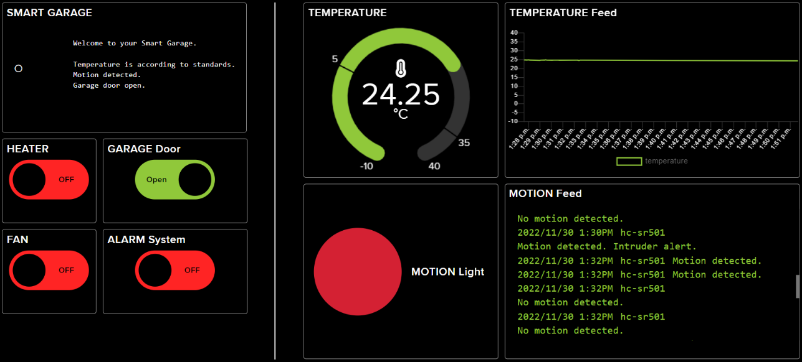

## Smart Garage System with the Raspberry Pi 4 and Adafruit IO

The Smart Garage System allows for remote monitoring and controlling of certain features of a house's garage. This prototype is built using a Raspberry Pi 4, electronic sensors and components, and a dashboard using Adafruit IO for display and controls.

### Features

- **Motion sensor based alarm and light system using a PIR HC-SR501 motion sensor, an active buzzer and LED light**

    A motion triggered lights and alarm system using the PIR HC-SR501 sensor, an active buzzer, and a LED light. 
    When motion is detected, the LED light turns on automatically, and then off once there is no motion. If the alarm system is turned on on Adafruit, and motion is detected, the active buzzer alarm will sound, indicating an intruder alert.

- **Temperature monitoring with the GY-521 module**

    Garages are often in need of some sort of temperature regulation and monitoring method, as they are often used for storage purposes. Items like record vinyls, oil paintings, computer servers, all require a certain temperature to perform best.
    Using the GY-521 accelerometer to measure temperature in Celsius, and then sending the data to an Adafruit feed, users can readily monitor the current temperature inside their garage. In future improvements, a heater or a fan can be connected for remote control and automation by setting up minimum and maximum temperature values, and controlling the heater and fan accordingly to adjust the temperature.

- **Garage door remote opening and closing with the KY-036 touch metal sensor**

    One of the most common and useful features of a Smart Garage System is remote control of the garage door. Whether to make sure you shut the door on your way out to work, or to be able to open it remotely a few seconds before you arrive home, this feature is simple but essential.
    We use the KY-036 metal touch sensor to detect whether the door is shut or open, and the Adafruit dashboard for remote features.

### How to use it